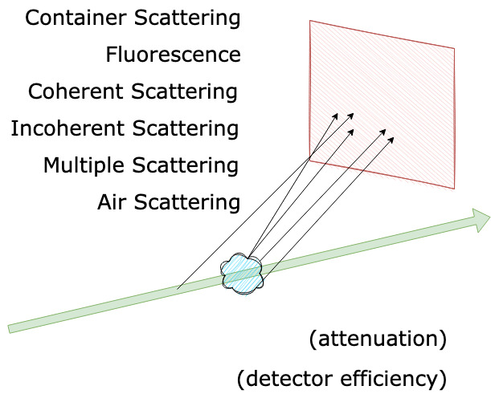

# uf-TS/PDF EuXFEL Processing/Analysis Meeting

---
## Agenda
1. uf-TS/PDF processing requirements (Dean)
2. EuXFEL processing capabilities (Luca)
3. Discussion of best processing route
4. Downstream analysis
5. AOB

---
# uf-TS/PDF Processing Requirements

Dean Keeble
12 April 2023

---
## Contents
- What is TS/PDF
- What is different to "normal" scattering experiments
- Processing vs Analysis
- What is required to process the data
- One possible solution
---

## What is TS/PDF?
TS = Total Scattering
i.e. we want to get to $F(Q)$, the total scattering structure factor
$$ 
F(Q) = \sum _{i,j=1}^{n} c_ic_jf_i(Q)f_j(Q)[A_{ij}(Q)-1]
$$

---
## What is the PDF?
If you've successfully extracted your $F(Q)$, it's straightforward$^{\mathsf{TM}}$ to convert it to the pair distribution function
$$
G(r)=\frac{1}{8\pi^3\rho_0}\int_0^{\infty}4\pi Q^2F(Q)\frac{\sin Qr}{Qr} \,\text{d}r
$$

---
## What is  different to "normal" scattering experiments
So a total scattering experiment is just a scattering experiment 

---
## Processing vs Analysis

---
## What is required to process the data

---
## One possible solution

---

## List of things
Normal markdown rules apply:

It helps us keep track of: 
- things
- other things
- those things over there
- and more! :o: :smiley: :white_check_mark:

---
<!--- make pictures wide --->

---

# fitting long lines to page width
#### <!--fit--> https://www.diamond.ac.uk/Instruments/Crystallography/I19/Manual/EH1.html

---
