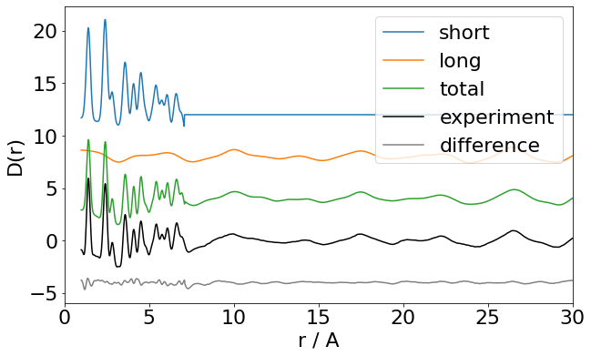

# uf-TS/PDF EuXFEL Processing/Analysis Meeting

---
## Agenda
1. uf-TS/PDF processing requirements (Dean)
2. EuXFEL processing capabilities (Luca)
3. Discussion of best processing route
4. Downstream analysis
5. AOB

---
# Dean, have you pressed record? 

---

# uf-TS/PDF Processing Requirements
Dean Keeble
12 April 2023

---
## Contents
- What is TS/PDF
- What is different to "normal" scattering experiments
- What is required to process the data
- One possible solution
- Processing vs Analysis
---

## What is a PDF? 
  

---

## What is TS/PDF?
TS = Total Scattering
i.e. we want to get to $F(Q)$, the total scattering structure factor
$$ 
F(Q) = \sum _{i,j=1}^{n} c_ic_jf_i(Q)f_j(Q)[A_{ij}(Q)-1]
$$

---
## How to get a PDF?
If you've successfully extracted your $F(Q)$, it's straightforward$^{\mathsf{TM}}$ to convert it to the pair distribution function
$$
G(r)=\frac{1}{8\pi^3\rho_0}\int_0^{\infty}4\pi Q^2F(Q)\frac{\sin Qr}{Qr} \,\text{d}r
$$

---

## Differences to "normal" diffraction
In order to extract the TS from a "normal" powder diffraction pattern, we need to:
1. Correctly subract the scattering from anything which isn't the sample
2. Correctly subtract everything which isn't coherent scattering
3. Normalise our data to arrive at the differential scattering cross section
4. Normalise to the sample's form factors

---

### A reminder of the proposed detector geometry on HED

---

## Fundamental Requirements
* Data that are *reproducible*
* Data that are *calibratable*
* Data that are *mergeable*
* A way to record and retrieve backgrounds/substrates/containers
* A way to record and retrieve sample metadata
* A way to link data from different $2\theta$ positions

---

## The two approaches
* Fully correct everything
  - relies on exactly known experimental conditions
  - delivers correctly scaled TS/PDF
  - as used in gudrun, PDFgetX2, vaxadium
* The "*ad hoc* method"
  - leverages known behaviour of various functions as $\{Q,r\}\to \{0,\infty\}$
  - delivers TS/PDF with arbitrary scale factor
  - as used in PDFgetX3
---
## One possible solution
- we populate a small sample database beforehand
- (somehow) get this metadata at the point of data collection
- use pyFAI to integrate data to 1D
- use PDFgetX3 to subtract container, normalise, FT [tenuous example](https://ispyb.diamond.ac.uk/dc/visit/cy32171-1/dcg/8949620)

---
## Processing vs Analysis
- Everything up to this point is "processing"
- Some analyses need no further data (peak fitting etc.)
- Some require further linking (cluster analysis, NMF etc.)
- Some require further sample information (structural fitting)